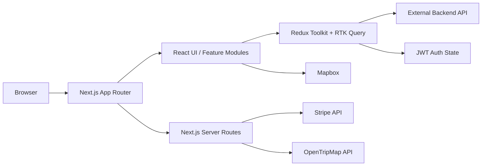

# Apex Adventure Lab

Apex Adventure Lab is a full-featured adventure travel and expedition-planning frontend built with **Next.js 16**, **React 19**, **TypeScript**, **Redux Toolkit / RTK Query**, **Tailwind CSS 4**, and **Stripe**.

The application combines public adventure content, membership subscriptions, trip-planning workflows, interactive travel maps, user and partner dashboards, article/resource management, and an administrative back office in a single Next.js App Router project.

> **Project status:** The application contains a mixture of production-style integrations and in-progress modules. In particular, the Scout AI trip-planning step is currently marked as under construction and does not yet connect to an AI provider.

---

## Table of Contents

- [Features](#features)
- [Tech Stack](#tech-stack)
- [Application Architecture](#application-architecture)
- [Project Structure](#project-structure)
- [Main Routes](#main-routes)
- [Prerequisites](#prerequisites)
- [Getting Started](#getting-started)
- [Environment Variables](#environment-variables)
- [Backend API](#backend-api)
- [Authentication and Roles](#authentication-and-roles)
- [TripTrax Trip Planning](#triptrax-trip-planning)
- [Explore Map](#explore-map)
- [Stripe Membership Payments](#stripe-membership-payments)
- [State Management](#state-management)
- [Content and Article Management](#content-and-article-management)
- [Feature Generator Scripts](#feature-generator-scripts)
- [Available Scripts](#available-scripts)
- [Deployment](#deployment)
- [Security Notes](#security-notes)
- [Development Notes](#development-notes)
- [Troubleshooting](#troubleshooting)

---

## Features

### Public Website

- Adventure-focused landing page
- About page
- Contact page
- Membership/pricing page
- Articles and individual article pages
- Privacy policy
- Terms and conditions
- Refund policy
- Responsive navigation and footer
- Dark/light theme support
- Smooth scrolling and animated UI elements

### Authentication

- User registration
- Email OTP verification
- Sign in
- Forgot-password workflow
- Reset-password verification flow
- JWT-based client authentication
- User profile retrieval and updates
- Logout support

### User Dashboard

- User overview
- Profile management
- Membership information
- Notifications
- Travel trip listing
- Individual trip report pages
- Multi-step trip creation workflow
- Monthly usage UI

### TripTrax

The TripTrax module provides an expedition-planning workflow with steps for:

1. Adventure mode
2. Trip basics
3. Group details
4. Goals and preferences
5. Risk tolerance
6. Water requirements
7. Scout AI
8. Trip review

Trip reports include UI sections for:

- Intel briefing
- Route and navigation
- Weather intelligence
- Expedition lodging
- Gear optimization
- Sustainment
- Safety protocols
- Files/assets
- Mission overview metrics

> The Scout AI step currently renders an under-construction state. AI-provider integration still needs to be implemented.

### Explore Map

- Mapbox-powered interactive map
- Location search
- Nearby-place discovery
- OpenTripMap integration
- Place-detail retrieval
- Category filters
- Map markers and navigation controls
- Location sidebar/cards
- Route-search UI

### Partnership Portal

- Partnership landing page
- Partner application wizard
- Partnership agreement flow
- Partner account area
- Partner dashboard
- Referral center
- Partner earnings
- Partner content area
- Partner performance UI
- Partnership resource management

### Admin Dashboard

Administrative modules include:

- Overview dashboard
- User management
- Trip package management
- Subscription management
- Payment management
- Article management
- Partnership management
- Partner detail views
- Partnership resource management
- Metrics and chart components

### Content Management

- Article listing
- Article details
- Add/edit article UI
- Rich text editing with Tiptap
- Image support
- Article advertisements/affiliations
- Resource management
- CSV export utility
- PDF export utility

### Membership and Payments

- Multiple membership tiers
- Standard and annual billing options
- Stripe Elements checkout
- Server-side Stripe subscription creation
- Payment success page
- Subscription/payment administration UI

---

## Tech Stack

| Area | Technology |
|---|---|
| Framework | Next.js 16.2 |
| UI Library | React 19 |
| Language | TypeScript |
| Styling | Tailwind CSS 4, SCSS |
| Component Primitives | Radix UI / shadcn-style components |
| Global State | Redux Toolkit |
| API State | RTK Query |
| Persistence | redux-persist |
| Forms | React Hook Form |
| Validation | Zod |
| Rich Text Editor | Tiptap 3 |
| Maps | Mapbox GL, react-map-gl |
| Travel Places | OpenTripMap API |
| Payments | Stripe, Stripe Elements |
| Tables | TanStack Table |
| Data Fetching | RTK Query, TanStack Query |
| Animation | Framer Motion, Lenis |
| Dates | date-fns, Day.js |
| Icons | Lucide React, React Icons |
| PDF Export | jsPDF, html2canvas-pro |
| CSV Parsing | Papa Parse |
| Notifications | Sonner |

---

## Application Architecture



The application uses two main API patterns:

1. **External application backend** — feature modules use RTK Query with `NEXT_PUBLIC_API_URL` as the base URL.
2. **Next.js server routes** — selected integrations such as Stripe subscription creation and OpenTripMap proxying are handled inside `src/app/api`.

---

## Project Structure

```text
.
├── public/                         # Static images, logos and icons
├── src/
│   ├── app/                        # Next.js App Router
│   │   ├── (admin)/                # Admin route group
│   │   ├── (auth)/                 # Authentication routes
│   │   ├── (frontend)/             # Public website routes
│   │   ├── (partnerShip)/          # Partner routes
│   │   ├── (payment)/              # Checkout/payment routes
│   │   ├── (userDashboard)/        # User dashboard routes
│   │   ├── api/                    # Next.js API routes
│   │   ├── articles/               # Public articles
│   │   └── explore/                # Explore map
│   │
│   ├── assets/                     # Application assets
│   ├── components/                 # Shared UI components
│   ├── constants/                  # Shared constants/menu configuration
│   ├── features/                   # Feature-first modules
│   │   ├── admin/
│   │   ├── affiliation/
│   │   ├── articles/
│   │   ├── auth/
│   │   ├── explore-map/
│   │   ├── member/
│   │   ├── metricksandcharts/
│   │   ├── notification/
│   │   ├── partnership/
│   │   ├── payment/
│   │   ├── resource/
│   │   ├── scoutai/
│   │   ├── triptrax/
│   │   └── user/
│   │
│   ├── hooks/                      # Shared React hooks
│   ├── lib/                        # Shared libraries/helpers
│   ├── providers/                  # Redux, theme and app providers
│   ├── redux/                      # Redux store and base RTK Query API
│   ├── styles/                     # Shared SCSS
│   ├── types/                      # Shared TypeScript types
│   └── utils/                      # General utilities
│
├── create-feature.sh               # Feature scaffolding helper
├── delete-feature.sh               # Feature removal helper
├── eslint.config.mjs
├── next.config.ts
├── package.json
├── postcss.config.mjs
└── tsconfig.json
```

The feature folders generally follow this pattern:

```text
src/features/example/
├── components/
├── hooks/
├── store/
│   └── example.slice.ts
├── example.api.ts
├── example.constants.ts
├── example.interface.ts
└── example.schema.ts
```

---

## Main Routes

### Public

| Route | Purpose |
|---|---|
| `/` | Landing page |
| `/about` | About Apex Adventure Lab |
| `/contact` | Contact page |
| `/memberships` | Membership plans |
| `/articles` | Article listing |
| `/articles/[id]` | Article details |
| `/explore` | Interactive explore map |
| `/privacy` | Privacy policy |
| `/terms` | Terms and conditions |
| `/refund` | Refund policy |

### Authentication

| Route | Purpose |
|---|---|
| `/signin` | User sign in |
| `/register` | Registration |
| `/verify-email` | Email verification |
| `/forgot-password` | Forgot password |
| `/verify-reset-code` | Verify reset code |
| `/reset-password` | Reset password |

### User Dashboard

| Route | Purpose |
|---|---|
| `/user-overview` | Dashboard overview |
| `/profile` | User profile |
| `/membership` | User membership |
| `/notification` | Notifications |
| `/travel-trips` | Trips |
| `/travel-trips/[id]` | Trip report/details |
| `/create-trip-plan` | New trip wizard |

### Partnership

| Route | Purpose |
|---|---|
| `/partnership` | Partnership landing page |
| `/partnerShip-apply` | Partner application |
| `/partnerShip-agreement` | Partnership agreement |
| `/partners-account` | Partner account |
| `/partner-dashboard` | Partner dashboard |
| `/partner-referral` | Referral center |
| `/partner-earning` | Earnings |
| `/partner-content` | Partner content |

### Admin

| Route | Purpose |
|---|---|
| `/admin-overview` | Admin overview |
| `/admin/users` | User management |
| `/admin/users/[id]` | User details |
| `/admin/trip-packages` | Trip packages |
| `/admin/trip-packages/[id]` | Trip package details |
| `/admin/subscriptions` | Subscription management |
| `/admin/subscriptions/[id]` | Subscription details |
| `/admin/payments` | Payment management |
| `/admin/payments/[id]` | Payment details |
| `/admin/article` | Article management |
| `/admin/article/add` | Add article |
| `/admin/article/[id]` | Edit/view article |
| `/admin/partnerships` | Partnership management |
| `/admin/partnerships/aii-partners` | All partners |
| `/admin/partnerships/aii-partners/[id]` | Partner details |
| `/admin/partnerships/resources` | Partnership resources |
| `/admin/partnerships/resources/add` | Add resource |

### Payment

| Route | Purpose |
|---|---|
| `/checkout` | Stripe checkout |
| `/checkout/success` | Successful checkout |

---

## Prerequisites

Install the following before starting:

- **Node.js 20.9.0 or newer**
- **npm**
- Access to the project backend API
- Mapbox access token for map functionality
- OpenTripMap API key for travel-place discovery
- Stripe account and API keys for payment functionality

Node.js `>=20.9.0` is required by the installed Next.js version.

---

## Getting Started

### 1. Clone the repository

```bash
git clone <repository-url>
cd <repository-directory>
```

### 2. Install dependencies

For a reproducible install using the lockfile:

```bash
npm ci
```

Or:

```bash
npm install
```

### 3. Configure environment variables

Create a local environment file:

```bash
cp .env.example .env.local
```

If an `.env.example` file is not present, create `.env.local` manually using the variables documented below.

### 4. Start the development server

```bash
npm run dev
```

The project is configured to run on:

```text
http://localhost:3053
```

---

## Environment Variables

The current codebase references the following environment variables.

Create `.env.local`:

```env
NEXT_PUBLIC_APP_NAME="Apex Adventure Lab"
NEXT_PUBLIC_APP_URL="http://localhost:3053"
NEXT_PUBLIC_API_URL="https://your-backend-api.example.com"

NEXT_PUBLIC_MAPBOX_TOKEN="your_mapbox_public_token"
NEXT_PUBLIC_OPENTRIPMAP_API_KEY="your_opentripmap_key"

NEXT_PUBLIC_STRIPE_PUBLISHABLE_KEY="pk_test_..."
NEXT_PUBLIC_STRIPE_SECRET_KEY="sk_test_..."
```

The archive also contains these names, although they are not currently referenced by application code:

```env
NEXT_PUBLIC_ENV="development"
NEXT_PUBLIC_PAYMENT_INTENT_ENDPOINT=""
```

### Variable Reference

| Variable | Required | Purpose |
|---|---:|---|
| `NEXT_PUBLIC_APP_NAME` | Recommended | Application name used in branding/SEO |
| `NEXT_PUBLIC_APP_URL` | Recommended | Canonical application URL |
| `NEXT_PUBLIC_API_URL` | Yes for backend features | Base URL for RTK Query requests |
| `NEXT_PUBLIC_MAPBOX_TOKEN` | Yes for maps | Mapbox browser token |
| `NEXT_PUBLIC_OPENTRIPMAP_API_KEY` | Yes for travel places | OpenTripMap access |
| `NEXT_PUBLIC_STRIPE_PUBLISHABLE_KEY` | Yes for checkout | Stripe.js public key |
| `NEXT_PUBLIC_STRIPE_SECRET_KEY` | Yes with current code | Stripe server API key |
| `NEXT_PUBLIC_ENV` | No/currently unused | Environment label |
| `NEXT_PUBLIC_PAYMENT_INTENT_ENDPOINT` | No/currently unused | Legacy/config placeholder |

> **Important:** `NEXT_PUBLIC_STRIPE_SECRET_KEY` should be renamed to a server-only variable such as `STRIPE_SECRET_KEY`. See [Security Notes](#security-notes).

---

## Backend API

Most feature APIs are implemented using RTK Query and send requests to:

```ts
process.env.NEXT_PUBLIC_API_URL
```

The shared API configuration is located at:

```text
src/redux/api/baseApi.ts
```

Requests use:

```ts
credentials: "include"
```

When a token exists in Redux auth state, it is added to the request headers as `Authorization`.

### Backend Endpoints Referenced by the Frontend

The frontend expects backend routes such as:

```text
/auth/login
/auth/logout
/otp/send
/otp/verify
/otp/verifyAndIssueToken
/users
/users/register
/users/profile
/articles
/partnership
/payment
/resource
/triptrax
/scoutai
/notification
/member
/admindashboard
/metricksandcharts
/explore-map
/affiliation
```

Several feature modules use standard CRUD patterns:

```text
GET    /resource
GET    /resource/:id
POST   /resource
PUT    /resource/:id
DELETE /resource/:id
```

The same pattern is scaffolded for multiple feature areas.

---

## Authentication and Roles

The application defines three roles:

```ts
ADMIN
USER
PARTNER
```

Role definitions are located in:

```text
src/features/user/user.interface.ts
```

Role-specific sidebar configuration is located in:

```text
src/constants/sidebarMenu.ts
```

### JWT Handling

JWT helper functionality exists in:

```text
src/utils/tokenHandler.ts
```

It supports:

- Decoding JWT tokens
- Checking token expiration
- Storing tokens in local storage
- Storing tokens in cookies
- Removing stored authentication data

RTK Query reads the current Redux auth token and sends it through the `Authorization` header.

---

## TripTrax Trip Planning

TripTrax is the main expedition-planning feature.

The trip-creation route is:

```text
/create-trip-plan
```

Its wizard is implemented under:

```text
src/features/triptrax/components/createNewTrip/
```

The wizard currently contains eight stages and is driven by a local reducer using the state and reducer definitions from the TripTrax slice.

Trip-report components live under:

```text
src/features/triptrax/components/tripReport/
```

### Scout AI Status

The Scout AI step is included in the wizard but currently displays:

```text
Under Construction
```

The previous conversational UI is present as commented code, but there is no active OpenAI, Anthropic, Gemini, or other AI-provider call in the Scout AI implementation included in this codebase.

---

## Explore Map

The explore experience combines **Mapbox** with **OpenTripMap**.

### Mapbox

Mapbox is used client-side for:

- Interactive maps
- Map navigation
- Location display
- Markers
- Category filtering
- Search-related map behavior

Required variable:

```env
NEXT_PUBLIC_MAPBOX_TOKEN="..."
```

### OpenTripMap

OpenTripMap requests are proxied through Next.js API routes.

Nearby locations:

```http
GET /api/travel-places?lat=<latitude>&lng=<longitude>
```

Place details:

```http
GET /api/travel-places/<xid>
```

The nearby-place route currently searches within a radius of approximately **30 km** and limits results before returning named places to the frontend.

---

## Stripe Membership Payments

Stripe checkout is implemented using:

- `@stripe/stripe-js`
- `@stripe/react-stripe-js`
- Stripe server SDK
- Stripe Elements

### Membership Plans

The codebase defines these plan identifiers:

- Core
- Plus
- Prime
- Elite

Each plan supports:

- Standard billing
- Annual billing

Plan configuration is located at:

```text
src/features/payment/components/pricing/data/pricing.ts
```

### Subscription Creation

The frontend calls:

```http
POST /api/payments/create-intent
```

Despite the route name, the server route currently creates a **Stripe subscription** with `payment_behavior: "default_incomplete"` and returns a client secret for Stripe Elements confirmation.

The route is implemented at:

```text
src/app/api/payments/create-intent/route.ts
```

### Production Consideration

The current server implementation creates a new temporary Stripe customer during checkout.

For production, retrieve the logged-in user and reuse the user's saved:

```text
stripeCustomerId
```

This prevents creating a new Stripe customer for every checkout attempt.

---

## State Management

Redux is configured in:

```text
src/redux/store.ts
```

Feature reducers include:

- Auth
- Users
- Notifications
- Scout AI
- TripTrax
- Resources
- Admin dashboard
- Members
- Metrics/charts
- Partnership
- Payments
- Explore map
- Affiliations
- Articles

RTK Query uses a shared `baseApi` instance.

### Redux Persist

`redux-persist` is configured with local web storage on the client and a no-op storage adapter during server rendering.

The current persistence whitelist is empty:

```ts
whitelist: []
```

Therefore feature state is not currently persisted through the whitelist, even though the persisted reducer/store infrastructure is enabled.

---

## Content and Article Management

The article module provides CRUD-style frontend API hooks and rich content editing.

Article routes include:

```text
/articles
/articles/[id]
/admin/article
/admin/article/add
/admin/article/[id]
```

Tiptap extensions support functionality such as:

- Headings
- Lists
- Blockquotes
- Code blocks
- Images
- Image upload UI
- Highlights
- Text alignment
- Subscript/superscript
- Typography
- Horizontal rules

Additional utility support includes:

```text
src/lib/handlePdfExport.ts
src/utils/exportToCsv.ts
```

---

## Feature Generator Scripts

The repository includes Bash scripts for scaffolding feature modules.

### Create a Feature

```bash
./create-feature.sh booking
```

For a kebab-case feature:

```bash
./create-feature.sh trip-history
```

The script creates:

```text
src/features/<feature>/
├── components/
├── hooks/
├── store/
├── <feature>.api.ts
├── <feature>.constants.ts
├── <feature>.interface.ts
└── <feature>.schema.ts
```

It also attempts to:

- Add the feature reducer to `src/redux/store.ts`
- Add the feature tag to `src/redux/api/baseApi.ts`

### Delete a Feature

Delete an entire feature:

```bash
./delete-feature.sh booking
```

Delete only one generated part:

```bash
./delete-feature.sh booking schema
./delete-feature.sh booking interface
./delete-feature.sh booking slice
./delete-feature.sh booking api
./delete-feature.sh booking hooks
./delete-feature.sh booking components
./delete-feature.sh booking constants
```

> These scripts use Unix shell tools such as `bash`, `sed`, `grep`, and `rm`. On Windows, run them through Git Bash or WSL.

---

## Available Scripts

### Development

```bash
npm run dev
```

Runs Next.js development mode on port `3053`.

### Production Build

```bash
npm run build
```

Creates an optimized production build.

### Production Server

```bash
npm run start
```

Starts the production server on port `3053`.

### Lint

```bash
npm run lint
```

The current `package.json` maps this command to:

```text
next lint
```

If linting fails because of CLI compatibility with the installed Next.js version, run ESLint directly and update the package script, for example:

```bash
npx eslint .
```

---

## Deployment

The project can be deployed to platforms that support Next.js 16 and Node.js 20+, including Vercel or a Node.js server/container.

### Production Checklist

Before deployment:

1. Configure the production backend URL.
2. Configure the production application URL.
3. Add the Mapbox token.
4. Add the OpenTripMap key.
5. Configure Stripe publishable and secret keys.
6. Replace any placeholder Stripe Price IDs with real recurring Stripe Price IDs.
7. Verify backend CORS and credential settings.
8. Verify role-based route protection.
9. Confirm all environment secrets are stored only in the hosting platform's secret manager/environment configuration.
10. Build the app locally before deployment.

Build with:

```bash
npm run build
```

Start with:

```bash
npm run start
```

The production server listens on port:

```text
3053
```

---

## Security Notes

### 1. Rename the Stripe Secret Variable

The current server route reads:

```env
NEXT_PUBLIC_STRIPE_SECRET_KEY
```

Variables beginning with `NEXT_PUBLIC_` are intended for browser-exposed configuration in Next.js.

A Stripe secret key should never be treated as public configuration.

Recommended change:

```env
STRIPE_SECRET_KEY="sk_..."
```

Then update the server route to use:

```ts
process.env.STRIPE_SECRET_KEY
```

### 2. Consider Making OpenTripMap Server-Only

The OpenTripMap key is already consumed through server routes, so it can also be renamed from:

```env
NEXT_PUBLIC_OPENTRIPMAP_API_KEY
```

to:

```env
OPENTRIPMAP_API_KEY
```

unless it is intentionally needed in browser code later.

### 3. Do Not Commit Environment Files

This supplied code archive contains `.env` and `.env.local` files.

Do not commit real keys or credentials to source control.

The current `.gitignore` ignores `.env*.local`, but it does not broadly ignore `.env`.

A safer setup is:

```gitignore
.env
.env.*
!.env.example
```

Keep only placeholder values inside `.env.example`.

### 4. Review Remote Image Configuration

`next.config.ts` currently permits remote images from wildcard HTTP and HTTPS hosts.

For production, restrict `remotePatterns` to the specific domains that the application actually needs.

### 5. Protect Server and Admin Routes

Client-side role menus are useful for navigation but should not be treated as authorization.

Admin and partner permissions must also be validated on the backend/server side.

---

## Development Notes

### Path Alias

The project uses:

```text
@/* → ./src/*
```

Example:

```ts
import { Button } from "@/components/ui/button";
```

### Fonts

The root layout uses Google fonts through `next/font`:

- Space Grotesk
- Work Sans

### Theme

Theme support is provided through `next-themes` and a custom `ThemeProvider`.

### UI Components

Reusable primitives live mainly in:

```text
src/components/ui/
```

The codebase uses Radix UI primitives along with Tailwind utility classes.

### Query Libraries

Both RTK Query and TanStack Query are installed. The primary feature API pattern in the current source is RTK Query.

### Tests

No automated test script or dedicated test suite is currently configured in `package.json`.

For long-term maintenance, consider adding unit/component and end-to-end tests for authentication, checkout, trip creation, and role-based access.

---

## Troubleshooting

### Application opens on the wrong port

This project does not use the default Next.js port `3000`.

Open:

```text
http://localhost:3053
```

### Backend requests fail

Verify:

```env
NEXT_PUBLIC_API_URL="..."
```

Also confirm that the backend accepts the frontend origin and supports credentialed requests if cookies are required.

### Mapbox does not render

Verify:

```env
NEXT_PUBLIC_MAPBOX_TOKEN="..."
```

Restart the development server after changing environment variables.

### Nearby places do not load

Verify the OpenTripMap key and test:

```text
/api/travel-places?lat=23.8103&lng=90.4125
```

A missing key causes the server route to return an error.

### Stripe checkout says it is not configured

Verify:

```env
NEXT_PUBLIC_STRIPE_PUBLISHABLE_KEY="pk_..."
```

For the current implementation, the server also requires the Stripe secret environment variable used by `src/app/api/payments/create-intent/route.ts`.

### Stripe says the Price ID must be replaced

Check:

```text
src/features/payment/components/pricing/data/pricing.ts
```

Each active membership/billing option must contain a valid recurring Stripe `price_...` ID.

### Scout AI does not respond

This is expected in the current codebase. The active Scout AI wizard step is intentionally marked under construction and has no AI backend/provider connected yet.

---

## Recommended Next Steps

For production readiness, the most important follow-up tasks are:

1. Move Stripe and OpenTripMap secrets to server-only environment variables.
2. Remove real environment files from source control history if they have ever been committed.
3. Complete the Scout AI server/provider integration.
4. Connect any remaining mock/admin UI sections to live backend endpoints.
5. Add server-enforced role authorization.
6. Reuse existing Stripe customers instead of creating a new customer for every checkout.
7. Add automated testing for critical user flows.
8. Restrict wildcard remote-image domains.

---

## License

No license file is included in the supplied codebase. Add an appropriate license before distributing the project publicly.

---

Built for **Apex Adventure Lab**.
